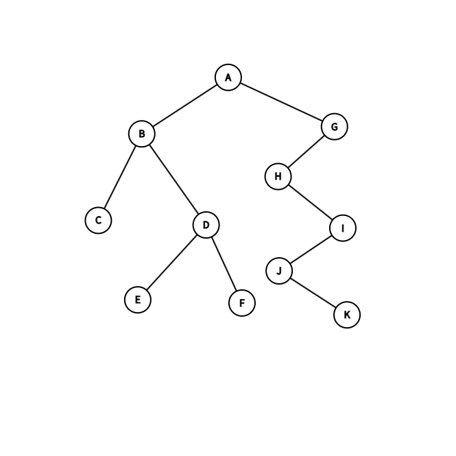
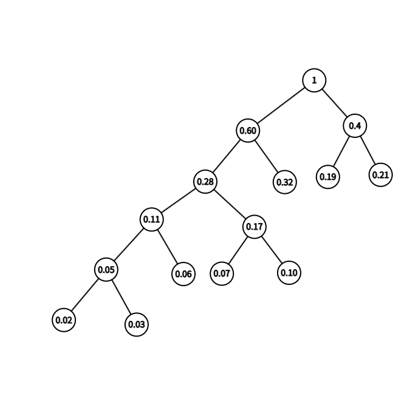

## 练习题
1.



2.

考虑叶节点 $i,j$

设它们的LCA为 $P$

若 $i,j$ 都在同一个子树中，则与最近公共祖先矛盾。

因此，不妨设 $i$ 在 $P$ 的左子树中，而 $j$ 在 $P$ 的右子树中。

前序遍历中，先访问 $i$ 再访问 $j$ 。

中序遍历中，先访问 $i$ 再访问 $j$ 。

后序遍历中，先访问 $i$ 再访问 $j$ 。

综上，相对位置相同。

3.

(1) 该哈夫曼树中有 $100$ 个叶子节点。

(2) 不断使用哈夫曼树的构建方法，得到以下哈夫曼树：



因此 这八个字母的哈夫曼编码分别是 $\{00000,00001,0001,0010,0011,01,10,11\}$

(3) 

优点：哈夫曼编码效率高，二进制编码效率低

缺点：哈夫曼编码实现难，二进制编码实现简单

4.

(1)
将序列视为完全二叉树的层次遍历，得到初始结构

```
        503（0）
      /      \
    87（1）  512（2）
   /  \      /  \
 61（3）908（4）170（5）897（6）
 /  \    /
275（7）653（8）462（9）
```

进行第一步调整

```
        503（0）
      /      \
    87（1）  512（2）
   /  \      /  \
 61（3）462（4）170（5）897（6）
 /  \    /
275（7）653（8）908（9）
```

最终答案

```
         61（0）
       /      \
     87（1）  170（2）
    /  \      /  \
 275（3）462（4）503（5）897（6）
 /  \    /
512（7）653（8）908（9）
```

(2) 

可能位于叶子节点。

(3) 

最后，树的高度为 $h = \lfloor \log_{2} n$

位于第 $i$ 层的节点最多下降 $h-i$ 层，层高为 $k$ 的节点下降最多会进行 $2k$ 次比较。

因此总比较次数 $M \leq 2 \sum\limits_{k=0}^{\lfloor \log_{2} n \rfloor -1} k \cdot \frac{n}{2^{k+1}}$

近似求和，得到 $C_0=2$

5.

考虑 $(n-1) \mathrm{mod} (k-1), $ 如果存在余数，则补上若干个0（虚节点）来满足条件。

然后，将所有的节点都放到一个小根堆中，每次取出 $k-1$ 个节点，合成一个新节点，再将这个点推回小根堆里，直到小根堆中只有一个节点为止。

按照上述操作，得到最小加权路径长度为 $705$ 。

## 补充习题
1.

```cpp
int pre(char op){
    if(op=='+'||op=='-') return 1;
    else if(op=='*'||op=='/') return 2;
    return 0;
}
bool isOperator(char c){
    return c=='+'||c=='-'||c=='*'||c=='/';
}
template<class T>
string dfs(BinaryTreeNode<T>* root){
    if(!root) return "";
    if(!root->left&&!root->right) return string(1,root->val);
    string left=dfs(root->left);
    string right=dfs(root->right);
    if(root->left&&isOperator(root->left->val)&&pre(root->left->val)<pre(root->val)) left="("+left+")";
    if(root->right&&isOperator(root->right->val)&&pre(root->right->val)<pre(root->val)) right="("+right+")";
    return left+root->val+right;
}
template<class T>
void Expression(BinaryTreeNode<T> *root){
    cout<<dfs(root)<<endl;
}
```

2.

```cpp
template<class T>
void BinarySearchTree<T>::removeVal(BinaryTreeNode <T> *&rt,const T val){
    if(rt->val<val){
        dfs(rt->right,val);
        return ;
    }
    else if(rt->val>val){
        dfs(rt->left,val);
        return ;
    }
    if(!rt->left) rt=rt->right;
    else if(!rt->right) rt=rt->left;
    else{
        auto cur=rt->right;
        while(cur->left){
            cur=cur->left;
        }
        cur->left=rt->left;
        rt=rt->right;
    }
    return ;
}
```

3.

```cpp
// 假设节点i的左孩子编号为i<<1,右孩子编号为(i<<1)+1
template<class T>
bool MinHeap<T>::Isheap(int position){
    if(position>n) return true;
    bool left=Isheap(position<<1);
    bool right=Isheap((position<<1)+1);
    bool left_1=((position<<1)>n)||((position<<1)<=n&&nums[position]<nums[(position<<1)]);
    bool right_1=((position<<1)+1>n)||((position<<1)+1<=n&&nums[position]<nums[(position<<1)+1]);
    return left&&right&&left_1&&right_1;
}
```